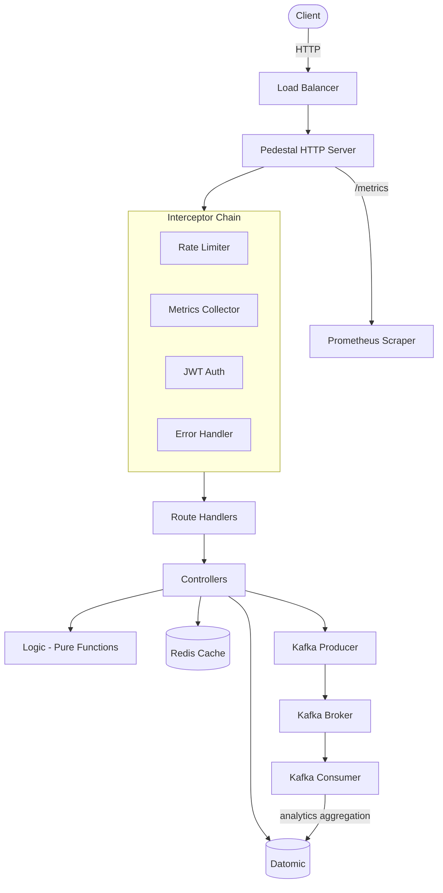
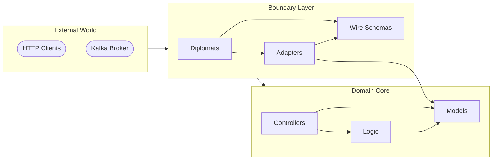
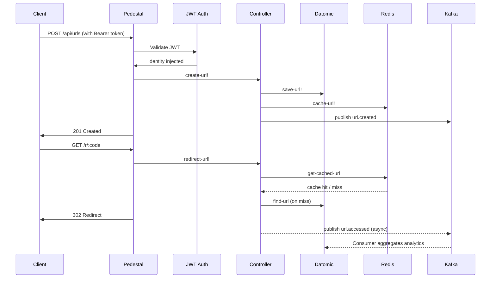

# Clojure URL Shortener

A production-grade URL shortener written in Clojure, following the Diplomat Architecture pattern. Uses Datomic for immutable URL storage, Redis for high-performance caching, and Apache Kafka for real-time click event streaming and analytics aggregation. Includes JWT authentication, per-IP rate limiting, Prometheus metrics, paginated statistics, and a full CI/CD pipeline via GitHub Actions.

---

## System Overview

---

## Stack

| Icon | Concern | Technology |
| --- | --- | --- |
|  | Language | Clojure |
|  | HTTP Server / API Gateway | Pedestal + Ring |
|  | Database / URL Storage | Datomic |
|  | Caching | Redis |
|  | Event Streaming | Apache Kafka |
|  | Schema Validation | Plumatic Schema |
|  | Observability | Prometheus Metrics |
|  | Containerization | Docker Compose |
|  | Testing | clojure.test |
|  | CI/CD | GitHub Actions |

---

## Architecture

Follows the **Diplomat Architecture** (Hexagonal Architecture variant), strictly separating domain logic from infrastructure. Each layer has a single responsibility and well-defined access rules.

- **Models** - Pure domain entities (`Url`, `UrlStats`, `ClickEvent`) defined with strict Prismatic Schemas. No dependencies on any other layer.
- **Logic** - Pure business rules without side effects: Base62 encoding, URL validation, expiration calculation, click counting, statistics aggregation, JWT token management, and rate limiting.
- **Controllers** - Use case orchestration following the logic sandwich pattern: consume data from diplomats, compute with pure logic, produce side effects through diplomats.
- **Adapters** - Pure transformation functions between wire schemas and domain models. Inbound adapters convert loose external data into strict internal models; outbound adapters do the reverse.
- **Wire** - External data contracts. `wire.in` uses loose schemas (tolerant reader), while `wire.out`, `wire.cache` and `wire.datomic` use strict schemas (conservative writer).
- **Diplomats** - All external communication: HTTP server (Pedestal), database (Datomic), cache (Redis), event streaming (Kafka producer and consumer). Each diplomat is fault-tolerant and manages its own Component lifecycle.

See [ARCHITECTURE.md](./ARCHITECTURE.md) for the full specification with layer access rules.

---

### Data Flow

---

## API

| Method   | Endpoint                       | Auth     | Description                    |
|----------|--------------------------------|----------|--------------------------------|
| `GET`    | `/health`                      | Public   | Health check                   |
| `GET`    | `/metrics`                     | Public   | Prometheus metrics             |
| `POST`   | `/api/auth/login`             | Public   | Authenticate and get JWT token |
| `POST`   | `/api/urls`                   | Required | Shorten a URL                  |
| `GET`    | `/r/:code`                     | Public   | Redirect to original URL       |
| `GET`    | `/api/urls/:code/stats`       | Required | Get click statistics (paginated) |
| `GET`    | `/api/urls/:code/analytics`   | Required | Get daily analytics breakdown  |
| `DELETE` | `/api/urls/:code`             | Required | Deactivate a short URL         |

---

## Security

- **JWT Authentication** - Protected endpoints require a `Bearer` token obtained via `/api/auth/login`.
- **Rate Limiting** - Per-IP token bucket: 30 req/min for API, 100 req/min for redirects, 5 req/min for login (brute force protection).
- **429 Too Many Requests** - Includes `Retry-After` header when rate limit is exceeded.

---

## Observability

- **`/metrics`** endpoint exposes Prometheus-compatible metrics.
- `http_requests_total` - Request count by method, path, and status.
- `http_request_duration_seconds` - Request latency histogram.
- `urlshortener_urls_created_total` - Business metric for URL creation.
- `urlshortener_redirects_total` - Business metric for redirects.
- `urlshortener_cache_hits_total` / `urlshortener_cache_misses_total` - Cache effectiveness.
- JVM metrics (GC, memory, threads) via Prometheus JVM instrumentation.

---

## Fault Tolerance

The service is designed to gracefully degrade when external dependencies are unavailable:

- **Redis unavailable** - Cache operations are skipped, all reads fall through to Datomic.
- **Kafka unavailable** - Events are silently dropped. URL operations continue normally. Analytics will not be updated.
- **Datomic** - Required for core operations. The service will not start without a valid connection.

---

## CI/CD

GitHub Actions pipeline runs on every push and PR to `main`:

- **Lint** - clj-kondo static analysis.
- **Test** - `lein test` on Java 11 and Java 17 matrix.
- **Coverage** - `lein coverage` report uploaded as artifact.

---

## Documentation

| Document | Description |
|----------|-------------|
| [ARCHITECTURE.md](./ARCHITECTURE.md) | Diplomat Architecture specification and layer access rules |
| [TESTING.md](./TESTING.md) | Testing guide, patterns and statistics (56 tests, 281 assertions) |
| [SETUP.md](./SETUP.md) | Prerequisites, getting started, API usage and configuration |
