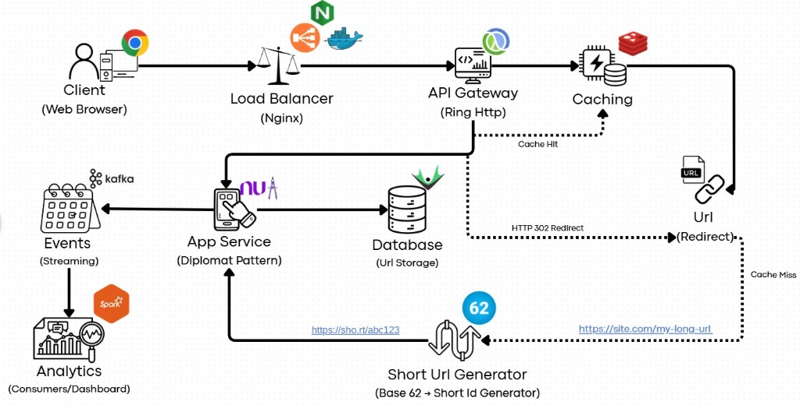
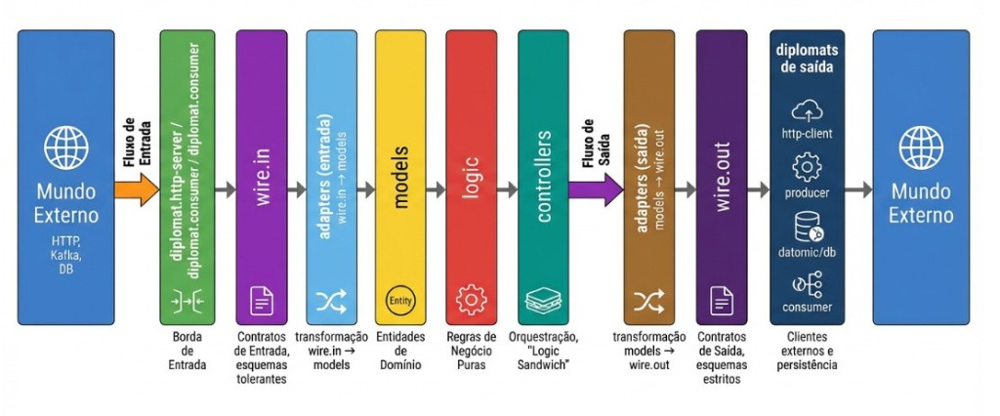
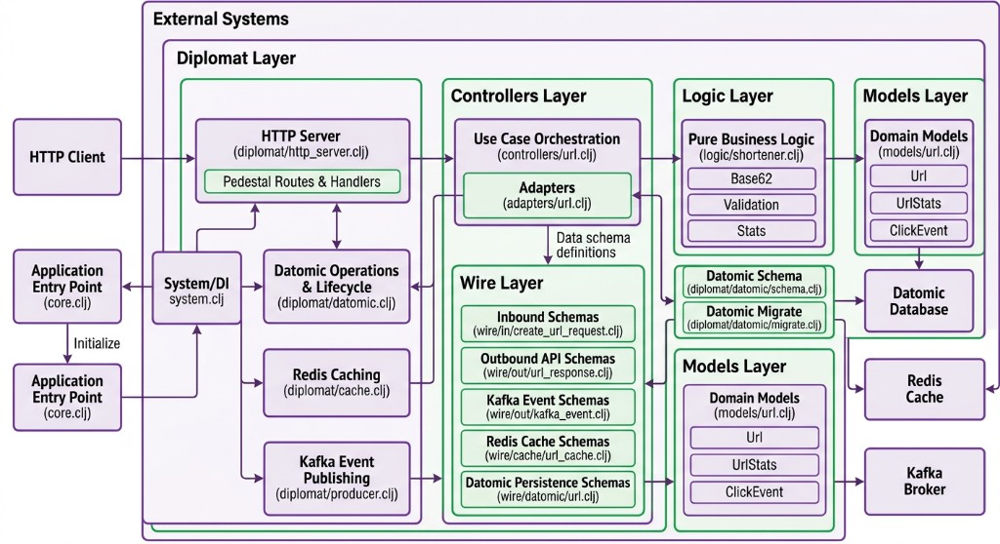
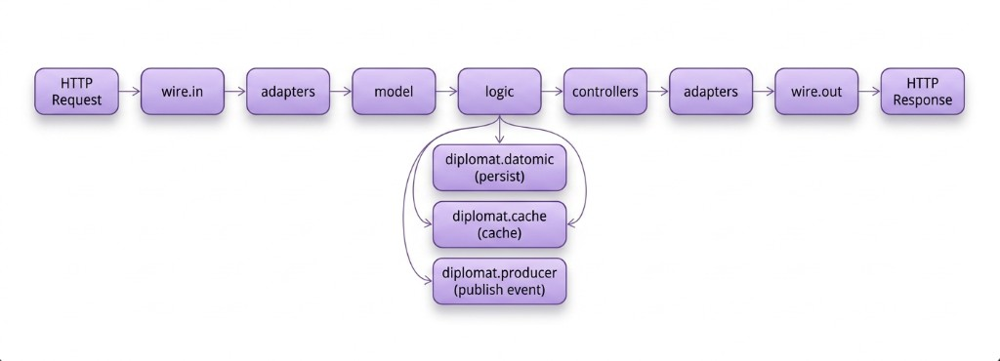

# Clojure URL Shortener

A production-grade URL shortener written in Clojure, following the Diplomat Architecture pattern. Uses Datomic for immutable URL storage and time-travel analytics, Redis for high-performance caching, and Apache Kafka for real-time click event streaming. Exposes a RESTful API via Pedestal with support for custom short codes, URL expiration and click statistics.

---

## Stack

| Icon | Concern | Technology |
| --- | --- | --- |
|  | Language | Clojure |
|  | HTTP Server / API Gateway | Pedestal + Ring |
|  | Database / URL Storage | Datomic |
|  | Caching | Redis |
|  | Event Streaming | Apache Kafka |
|  | Schema Validation | Plumatic Schema |
|  | Containerization | Docker Compose |
|  | Testing | clojure.test |

---

## Architecture

Follows the **Diplomat Architecture** (Hexagonal Architecture variant), strictly separating domain logic from infrastructure. Each layer has a single responsibility and well-defined access rules.

- **Models** - Pure domain entities (`Url`, `UrlStats`, `ClickEvent`) defined with strict Prismatic Schemas. No dependencies on any other layer.
- **Logic** - Pure business rules without side effects: Base62 encoding, URL validation, expiration calculation, click counting and statistics aggregation.
- **Controllers** - Use case orchestration following the logic sandwich pattern: consume data from diplomats, compute with pure logic, produce side effects through diplomats.
- **Adapters** - Pure transformation functions between wire schemas and domain models. Inbound adapters convert loose external data into strict internal models; outbound adapters do the reverse.
- **Wire** - External data contracts. `wire.in` uses loose schemas (tolerant reader), while `wire.out`, `wire.cache` and `wire.datomic` use strict schemas (conservative writer).
- **Diplomats** - All external communication: HTTP server (Pedestal), database (Datomic), cache (Redis) and event streaming (Kafka). Each diplomat is fault-tolerant and manages its own Component lifecycle.

See [ARCHITECTURE.md](./ARCHITECTURE.md) for the full specification with layer access rules.

---

### Project Structure

---

### Data Flow

---

## API

| Method   | Endpoint                  | Description              |
|----------|---------------------------|--------------------------|
| `GET`    | `/health`                 | Health check             |
| `POST`   | `/api/urls`               | Shorten a URL            |
| `GET`    | `/r/:code`                | Redirect to original URL |
| `GET`    | `/api/urls/:code/stats`   | Get click statistics     |
| `DELETE` | `/api/urls/:code`         | Deactivate a short URL   |

---

## Fault Tolerance

The service is designed to gracefully degrade when external dependencies are unavailable:

- **Redis unavailable** - Cache operations are skipped, all reads fall through to Datomic.
- **Kafka unavailable** - Events are silently dropped. URL operations continue normally.
- **Datomic** - Required for core operations. The service will not start without a valid connection.

---

## Documentation

| Document | Description |
|----------|-------------|
| [ARCHITECTURE.md](./ARCHITECTURE.md) | Diplomat Architecture specification and layer access rules |
| [TESTING.md](./TESTING.md) | Testing guide, patterns and statistics (39 tests, 182 assertions) |
| [SETUP.md](./SETUP.md) | Prerequisites, getting started, API usage and configuration           |