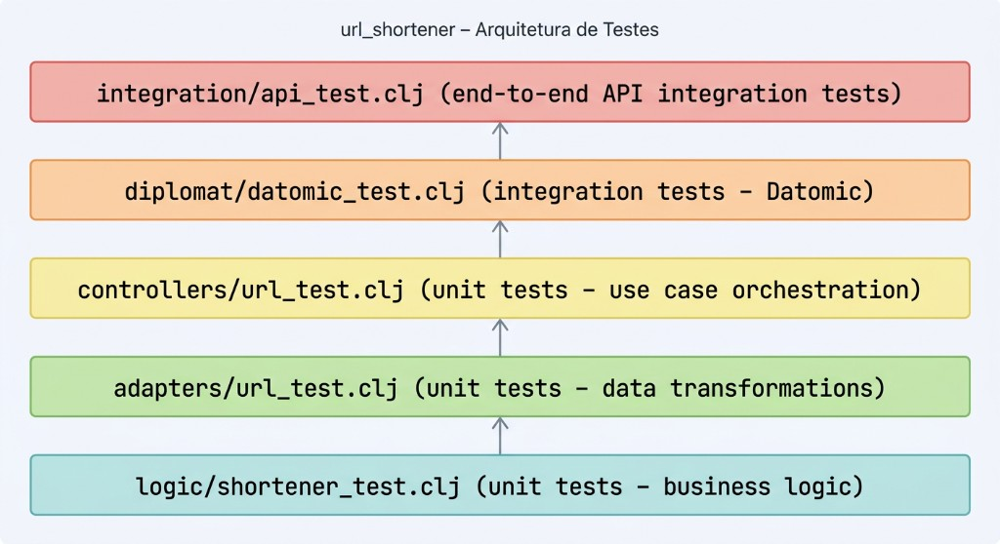

# Testing Guide

## Test Structure



## Test Categories

### Unit Tests (Fast, Isolated)

**Logic Tests** (`logic/shortener_test.clj`)
- Base62 encoding/decoding
- URL validation
- Custom short code validation
- Short code generation
- Expiration calculation
- Click counting
- Statistics calculation

**Auth Tests** (`logic/auth_test.clj`)
- Password hashing and verification (bcrypt+sha512)
- JWT token generation and validation
- Expired token rejection
- Bearer token extraction from headers

**Rate Limiter Tests** (`logic/rate_limiter_test.clj`)
- Limiter creation with configurable limits
- Requests allowed within limit
- Requests blocked when exceeding limit
- Separate limits per IP and per route group
- Token refill over time

**Adapter Tests** (`adapters/url_test.clj`)
- Wire request to model transformations
- Model to wire response transformations
- Model to cache conversions
- Cache to model conversions
- Model to Datomic conversions
- Datomic to model conversions
- Click event to Datomic conversions
- Click event to Kafka event conversions
- Model to redirect response conversions
- Roundtrip stability (model -> datomic -> model)

**Controller Tests** (`controllers/url_test.clj`)
- URL creation use case with protocol-based mock diplomats
- URL redirection use case with click counting and event publishing
- Multiple sequential clicks handling

### Integration Tests (In-Memory Infrastructure)

**Datomic Tests** (`diplomat/datomic_test.clj`)
- URL persistence (save and find)
- URL update operations
- Click event storage
- Find by short code queries
- URL deactivation
- Time-travel queries
- Transactional integrity

**API Tests** (`integration/api_test.clj`)
- Health check endpoint
- URL creation (POST `/api/urls`)
- URL redirect (GET `/r/:code`)
- URL statistics (GET `/api/urls/:code/stats`)
- URL deactivation (DELETE `/api/urls/:code`)
- Complete lifecycle (create -> redirect -> stats -> deactivate -> 410 gone)

## Running Tests

### All Tests

```bash
lein test
```

### Unit Tests Only (Fast)

```bash
lein test-unit
```

### Integration Tests Only

```bash
lein test-integration
```

### Specific Test Namespace

```bash
lein test :only url-shortener.logic.shortener-test
```

### Specific Test

```bash
lein test :only url-shortener.logic.shortener-test/number->base62-test
```

### Watch Mode (Auto-run on file changes)

```bash
lein test-refresh
```

## Code Coverage

Generate coverage report:

```bash
lein coverage
```

View report at `target/coverage/index.html`.

## Test Statistics

| Category | Tests | Assertions |
|----------|-------|------------|
| Logic (shortener) | 13 | 71 |
| Logic (auth) | 4 | 14 |
| Logic (rate-limiter) | 3 | 14 |
| Adapters | 12 | 64 |
| Controllers | 6 | 29 |
| Diplomat (cache) | 2 | 12 |
| Diplomat (producer) | 3 | 9 |
| Diplomat (datomic) | 7 | 19 |
| Integration | 6 | 32 |
| **Total** | **54** | **270** |

## Test Patterns

### Unit Test Pattern

```clojure
(deftest function-name-test
  (testing "describes what it tests"
    (is (= expected (function-name input)))
    (is (thrown? Exception (function-name invalid-input)))))
```

### Integration Test with NoOp Mocks

Integration tests use in-memory Datomic and NoOp records for Cache and Producer, removing the need for external Redis or Kafka services.

```clojure
(defrecord NoOpCache [])
(defrecord NoOpProducer [])

(defn setup-system []
  (d/create-database test-uri)
  (let [conn (d/connect test-uri)]
    (schema/migrate! conn)
    (let [datomic (diplomat.datomic/map->Datomic {:uri test-uri :conn conn})
          components {:datomic datomic
                      :cache (->NoOpCache)
                      :producer (->NoOpProducer)}
          service-map (diplomat.http-server/build-service-map components {:port 0})
          servlet (http/create-servlet service-map)]
      (reset! service-fn (::http/service-fn servlet)))))
```

## Test Data Fixtures

Common test data is defined in each test file:

```clojure
(def sample-url-model
  {:id #uuid "123e4567-e89b-12d3-a456-426614174000"
   :original-url "https://example.com/test"
   :short-code "abc123"
   :created-at #inst "2024-01-15T10:30:00.000-00:00"
   :clicks 0
   :active? true})
```

## Mocking Strategy

### Controller Tests - Protocol-based Mocks

```clojure
(defrecord MockDatomic []
  controllers/IDatomic
  (save-url! [_ url] ...)
  (find-url-by-short-code [_ code] ...)
  (update-url! [_ url] ...))

(defrecord MockProducer []
  controllers/IProducer
  (publish-url-created! [_ event] ...)
  (publish-url-accessed! [_ event] ...))
```

### Integration Tests - NoOp Records

```clojure
(defrecord NoOpCache [])
(defrecord NoOpProducer [])
```

Cache and producer operations silently succeed with no side effects, isolating tests to only verify Datomic persistence and HTTP routing.

## Continuous Integration

### GitHub Actions Example

```yaml
name: Tests

on: [push, pull_request]

jobs:
  test:
    runs-on: ubuntu-latest
    steps:
      - uses: actions/checkout@v4
      - name: Install dependencies
        run: lein deps
      - name: Run unit tests
        run: lein test-unit
      - name: Run integration tests
        run: lein test-integration
      - name: Generate coverage
        run: lein coverage
```

## Debugging Tests

### Run with Verbose Output

```bash
LEIN_VERBOSE=true lein test
```

### REPL-driven Testing

```clojure
(require '[clojure.test :refer :all])
(require '[url-shortener.logic.shortener-test])

(run-tests 'url-shortener.logic.shortener-test)

(test-var #'url-shortener.logic.shortener-test/number->base62-test)
```

## Adding New Tests

1. Create test file in `test/` mirroring `src/` structure.
2. Require `clojure.test` and the namespace under test.
3. Use `deftest` for test functions.
4. Use `testing` for nested descriptions.
5. Use `is` for assertions.
6. Follow naming convention: `function-name-test`.
